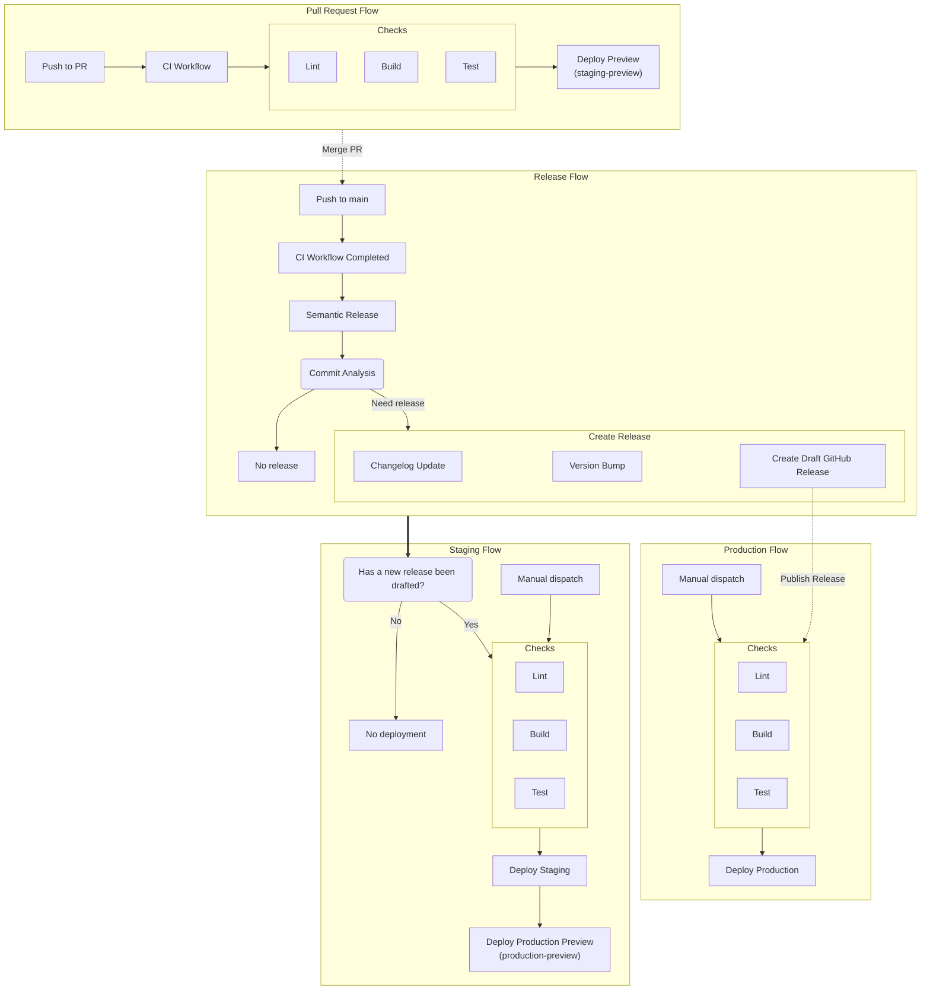
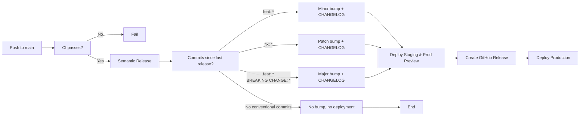

# CI/CD Pipeline Documentation

## Overview

This project uses GitHub Actions for continuous integration and deployment. The pipeline supports:

- Pull Request validation with preview deployments
- Automated releases via semantic-release
- Staging and Production deployments

## Workflow Architecture

## Workflow Details

### 1. CI Workflow (`.github/workflows/ci.yml`)

**Triggers:**

- Push to `main` branch
- Pull request to `main` branch

**Jobs:**
| Job | Description |
|-----|-------------|
| `lint` | Runs linter, typecheck, and format validation |
| `build` | Builds all packages |
| `test` | Runs tests with coverage |
| `deploy-preview` | Deploys to staging-preview environment (PR only) |

**Deployment:** Preview URL based on PR title

### 2. Release Workflow (`.github/workflows/release.yml`)

**Trigger:** CI workflow completes successfully after push to `main`

**Process:**

1. Run `semantic-release`:
   - Analyzes commits for conventional commits
   - Generates changelog
   - Bumps version in `package.json`
   - Creates Git tag
   - Creates GitHub Release (draft)
2. Format files: `package.json`, `CHANGELOG.md`
3. Commits changes: `package.json`, `CHANGELOG.md`

**Semantic Release Plugins:**

- `@semantic-release/commit-analyzer`
- `@semantic-release/release-notes-generator`
- `@semantic-release/changelog`
- `@semantic-release/npm`
- `@semantic-release/exec` (format files)
- `@semantic-release/git`
- `@semantic-release/github`

### 3. Deploy Staging Workflow (`.github/workflows/deploy-staging.yml`)

**Triggers:**

- `workflow_run`: After Release workflow completes (only proceeds if version was bumped)
- Manual `workflow_dispatch`

**Jobs:**
| Job | Description |
|-----|-------------|
| `lint` | Runs linter, typecheck, and format validation |
| `build` | Builds all packages |
| `test` | Runs tests with coverage |
| `deploy-staging` | Deploy to staging environment |
| `deploy-prod-preview` | Deploy preview build to production-preview URL |

### 4. Deploy Production Workflow (`.github/workflows/deploy-production.yml`)

**Triggers:**

- GitHub Release published
- Manual `workflow_dispatch`

**Jobs:**
| Job | Description |
|-----|-------------|
| `lint` | Runs linter, typecheck, and format validation |
| `build` | Builds all packages |
| `test` | Runs tests with coverage |
| `deploy-prod` | Deploy to production environment |

### 5. Pull Request Title Validation (`.github/workflows/pull-request-title.yml`)

**Trigger:** PR opened, reopened, or edited

**Validation:** Enforces conventional commit format for PR titles

## Reusable Job Templates

| Workflow          | Purpose                            |
| ----------------- | ---------------------------------- |
| `jobs.lint.yml`   | Lint, typecheck, format check      |
| `jobs.build.yml`  | Build with turbo, upload artifacts |
| `jobs.test.yml`   | Run tests with coverage            |
| `jobs.deploy.yml` | Generic deployment job             |

## Concurrency Settings

| Workflow          | Concurrency Group            | Cancel In Progress |
| ----------------- | ---------------------------- | ------------------ |
| CI                | `main` or `ci-{pr_number}`   | Yes                |
| Release           | `main`                       | Yes                |
| Deploy Staging    | Per workflow run             | Yes                |
| Deploy Production | `${{ workflow }}-${{ ref }}` | Yes                |

## Environments

| Environment          | Purpose                  |
| -------------------- | ------------------------ |
| `staging-preview`    | Preview from PR          |
| `staging`            | Staging environment      |
| `production-preview` | Production preview build |
| `production`         | Production deployment    |

## Version Bump Decision Flow

